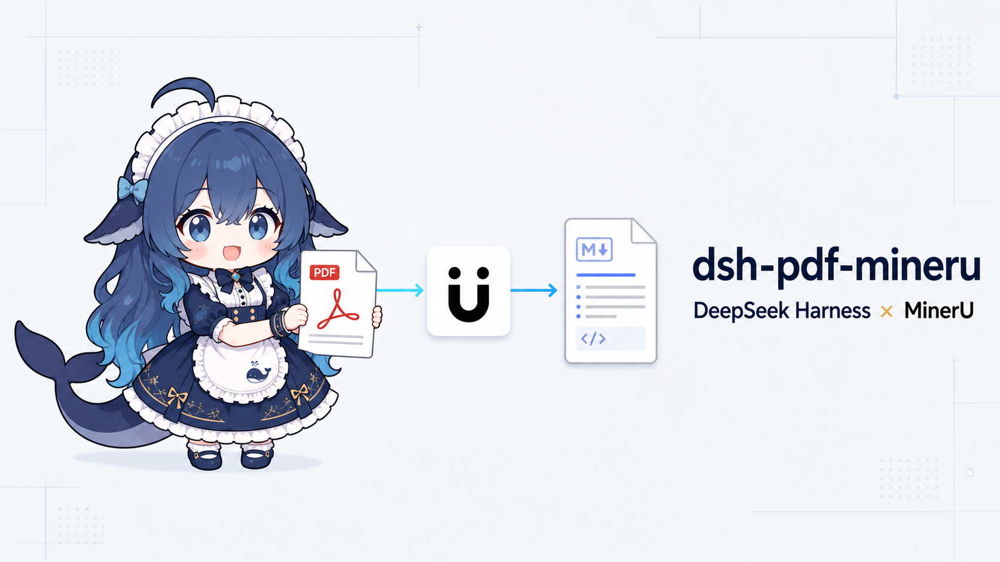
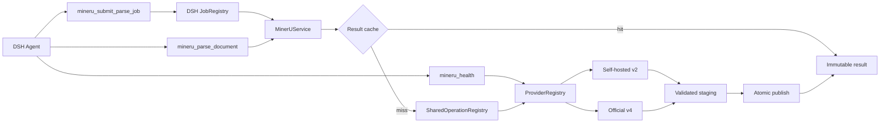
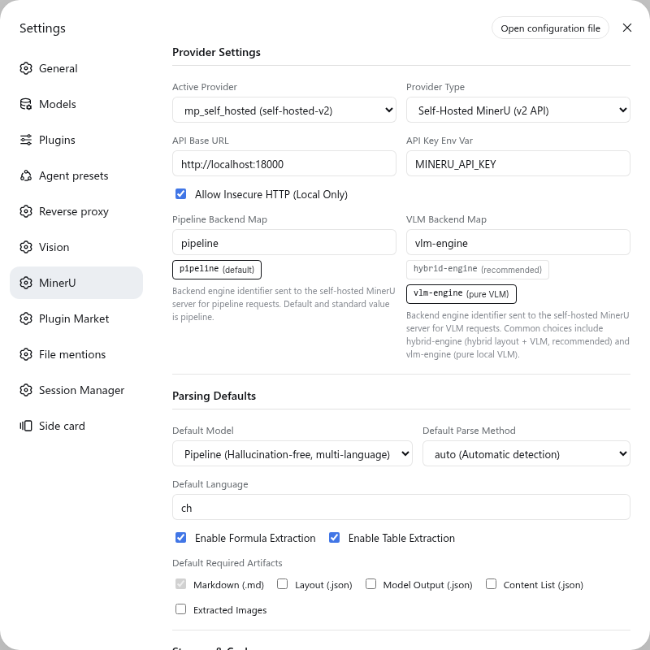

<div align="center">



# dsh-pdf-mineru

**让 DeepSeek Harness 以统一方式使用 MinerU 解析文档**

自托管 MinerU v2 与官方云 v4，共用同一套模型工具、原生后台任务和不可变结果缓存。

<p>
  <a href="https://www.npmjs.com/package/dsh-pdf-mineru"></a>
  <a href="./package.json"></a>
  
  
  <a href="./LICENSE"></a>
</p>

[快速开始](#快速开始) · [核心能力](#核心能力) · [模型工具](#模型工具) · [Provider](#provider-对照) · [配置](#配置) · [安全与存储](#安全与存储) · [开发](#开发与验证)

</div>

---

一个插件，两个 Provider，三项模型工具。模型不需要理解上游的 task ID、batch ID、预签名上传地址、状态 URL 或 ZIP 结构，只需要选择同步直返或 DSH 原生后台任务。

> [!NOTE]
> 本项目是独立维护的 DSH 社区插件。Provider 只负责适配 MinerU 上游协议，DSH Job、缓存、安全边界和工具输出由插件统一管理。

## 快速开始

### 1. 安装

DeepSeek Harness 的 Web profile 可以直接安装 npm 包：

```sh
dsh plugin --profile web add dsh-pdf-mineru
```

本地开发或测试 checkout：

```sh
dsh plugin --profile web add link:/absolute/path/to/dsh-pdf-mineru
```

> [!TIP]
> 使用 pnpm 10+ 从源码安装时，需要在 profile 的 `pnpm-workspace.yaml` 中显式允许所需构建脚本。

### 2. 连接 MinerU

打开 **Settings → MinerU**，选择活动 Provider：

- **Self-hosted v2**：默认连接 `http://localhost:18000`，本地 HTTP 需要显式启用 `Allow Insecure HTTP`。
- **Official v4**：默认连接 `https://mineru.net/api/v4`，并通过 DSH Credential 或环境变量提供 Token。

官方云最小凭据配置：

```sh
export MINERU_API_KEY="your-token"
```

在 Settings 中将 **API Key Env Var** 保持为 `MINERU_API_KEY`，点击 **Test Active Provider** 验证连通性与鉴权。

### 3. 交给 Agent

直接描述需要解析的本地文档和期望产物，例如：

```text
请用 MinerU 解析 /absolute/path/to/paper.pdf，保留 Markdown、图片和 content list。
```

长文档或不希望阻塞当前回合时：

```text
把 /absolute/path/to/report.pdf 作为 MinerU 后台任务解析，完成后读取结果。
```

Agent 会根据任务选择 `mineru_parse_document` 或 `mineru_submit_parse_job`。异步任务由 DSH 通用的 `job_output`、`job_list` 和 `job_kill` 管理。

## 核心能力

<table>
  <tr>
    <td width="50%" valign="top"><strong>DSH 原生后台任务</strong><br><br>异步解析注册为 `mineru-N` Job。DSH 负责 owner 隔离、完成通知、结果读取和取消，插件不维护第二套会话 Job。</td>
    <td width="50%" valign="top"><strong>同步直接返回结果</strong><br><br>`mineru_parse_document` 直接返回 Markdown preview、immutable manifest 和产物路径，不创建插件 Job。</td>
  </tr>
  <tr>
    <td width="50%" valign="top"><strong>双 Provider 统一接口</strong><br><br>同一套 `pipeline` / `vlm` 语义适配自托管 FastAPI v2 和 MinerU 官方云 v4，协议字段不会进入模型上下文。</td>
    <td width="50%" valign="top"><strong>不可变内容寻址缓存</strong><br><br>源文件 SHA-256、解析语义、产物集合、Provider compatibility key 和 schema 版本共同决定 CacheKey。</td>
  </tr>
  <tr>
    <td width="50%" valign="top"><strong>并发请求合并</strong><br><br>同一进程内，相同 CacheKey 只产生一个上游解析。单个等待者超时或取消不会破坏其他调用共享的 producer。</td>
    <td width="50%" valign="top"><strong>受控发布与运维</strong><br><br>产物经过 staging 校验和同文件系统原子 rename 后发布；Settings 提供统计、完整性扫描、GC preview、缓存清理和 quarantine 管理。</td>
  </tr>
</table>

## 模型工具

插件只暴露三项 MinerU 工具：

| 工具 | 行为 | 返回值 |
| --- | --- | --- |
| `mineru_health` | 探测活动 Provider 的连通性、鉴权、协议版本和可用队列信息 | 结构化健康状态 |
| `mineru_parse_document` | 同步等待解析；超时只结束当前等待，不终止共享 producer | immutable result、Markdown preview、manifest 与产物路径 |
| `mineru_submit_parse_job` | 注册原生 DSH 后台任务并立即返回 | `mineru-N`，最终输出由通用 Job 工具读取 |

### 解析参数

| 参数 | 类型 | 默认值 | 说明 |
| --- | --- | --- | --- |
| `file_paths` | `string[]` | 必填 | 本地文档路径。支持批量数组，默认安全上限为 1，可通过 `limits.maxFilesPerRequest` 调整 |
| `model` | `pipeline` / `vlm` | Settings 默认值 | 统一解析模型 |
| `ocr` | `boolean` | `false` | 对全部页面强制 OCR |
| `language` | `string` | `ch` | MinerU 语言提示代码 |
| `formula` | `boolean` | `true` | 识别数学公式 |
| `table` | `boolean` | `true` | 识别表格结构 |
| `pages` | `string` | 全部页面 | 1-based 页码范围，例如 `1-10,15` |
| `artifacts` | `string[]` | `["markdown"]` | `markdown`、`layout`、`model-output`、`content-list`、`images` |
| `poll_timeout_ms` | `integer` | `600000` | 仅同步工具使用；限制本次等待时间 |

Markdown 始终包含在规范化产物集合中。大段 preview 会按配置截断，完整产物仍保存在 result manifest 指向的路径中。

## 工作方式



- **RequestNormalizer** 规范参数、页码范围和产物集合，并流式计算源文件 SHA-256。
- **ResultRepository** 校验并读取不可变结果；源文件绝对路径不会写入规范请求或 manifest。
- **SharedOperationRegistry** 只在当前进程内合并相同请求，不提供跨进程协调。
- **ProviderRegistry** 在一次操作生命周期内固定 Provider 配置，避免任务中途切换后端。

## Provider 对照

| | Self-hosted MinerU v2 | Official MinerU v4 |
| --- | --- | --- |
| Provider ID | `self-hosted-v2` | `official-v4` |
| 提交方式 | 流式 multipart `POST /tasks` | 申请预签名地址后执行裸 `PUT` |
| 状态与结果 | 轮询任务并收集 JSON | 轮询 batch，下载并安全解包 ZIP |
| 模型 | 通过 `modelMap` 显式映射 `pipeline` / `vlm` | 原生 `pipeline` / `vlm` |
| parse method | `auto`、`ocr`、`txt` | `auto`、`ocr`；`txt` 会明确失败 |
| HTTP | 本地部署可显式允许 HTTP | 强制 HTTPS |
| 上游限制 | 取决于服务端配置与插件安全限制 | 单文件不超过 200 MB、200 页 |

Provider 不注册工具、不访问 DSH Session、不决定存储路径，也不生成模型文案。它只负责上游协议转换、轮询与产物收集。

## 配置

推荐通过 **Settings → MinerU** 编辑配置。Provider、解析默认值、轮询、重试和输出限制对新任务实时生效；`storageRoot` 变更需要重启插件进程。

<p align="center">
  
</p>
<p align="center"><sub>Provider 与解析默认值的可视化配置；同一页面还提供缓存、重试、安全限制和存储运维。</sub></p>

<details>
<summary><strong>Self-hosted v2 最小配置</strong></summary>

```yaml
schemaVersion: 1
activeProvider: mp_self_hosted
providers:
  - id: mp_self_hosted
    type: self-hosted-v2
    baseURL: http://localhost:18000
    apiKeyEnv: MINERU_API_KEY
    allowInsecureHttp: true
    modelMap:
      pipeline: pipeline
      vlm: vlm-engine
defaults:
  model: pipeline
  ocr: false
  parseMethod: auto
  language: ch
  formula: true
  table: true
  artifacts: [markdown]
retry:
  maxAttempts: 3
  baseDelayMs: 500
  maxDelayMs: 10000
```

`modelMap` 不会猜测或静默降级。可将统一的 `vlm` 显式映射到 `hybrid-engine`、`vlm-engine` 或服务端实际提供的后端名称。

</details>

<details>
<summary><strong>Official v4 最小配置</strong></summary>

```yaml
schemaVersion: 1
activeProvider: mp_official
providers:
  - id: mp_official
    type: official-v4
    baseURL: https://mineru.net/api/v4
    apiKeyEnv: MINERU_API_KEY
    models: [pipeline, vlm]
    configuredVersion: v4
defaults:
  model: vlm
  ocr: false
  parseMethod: auto
  language: ch
  formula: true
  table: true
  artifacts: [markdown]
```

Official v4 无法表达自托管专用的 `parseMethod: txt`。插件会返回明确错误，不会将其等同于 `ocr: false`。

</details>

<details>
<summary><strong>完整运行限制与存储配置</strong></summary>

```yaml
storage:
  storageRoot: /absolute/path/to/dsh/cache/pdf-mineru
  cacheEnabled: true
  retainSources: false
  stagingTtlMs: 86400000

polling:
  pollIntervalMs: 2000
  pollTimeoutMs: 600000
  requestTimeoutMs: 60000
  operationTimeoutMs: 3600000

retry:
  maxAttempts: 3
  baseDelayMs: 500
  maxDelayMs: 10000

output:
  maxInlineChars: 200000

limits:
  maxFilesPerRequest: 1
  maxFileBytes: 209715200
  maxApiResponseBytes: 8388608
  maxZipDownloadBytes: 536870912
  maxZipEntries: 10000
  maxZipEntryBytes: 268435456
  maxZipTotalBytes: 2147483648
  maxZipCompressionRatio: 200
```

`storageRoot` 必须使用绝对路径。默认值为 `$DSH_HOME/cache/pdf-mineru`；未设置 `DSH_HOME` 时使用 `~/.dsh/cache/pdf-mineru`。

</details>

配置只保存 Credential reference，例如 `MINERU_API_KEY`。每次 Provider 调用时，插件先从 DSH Credential Service 解析，再回退到同名环境变量；Token 值不会写入配置或缓存。

## 安全与存储

### 内容寻址结果

```text
$DSH_HOME/cache/pdf-mineru/
├── results/sha256/<prefix>/<cache-key>/manifest.json
├── staging/<operation-id>/
├── quarantine/<timestamp_reason_id>/
└── .process.lock
```

- 已发布结果按单文件保存且不可修改，批量请求按文件 fan-out。
- staging 通过校验后只允许同文件系统原子 rename；`EXDEV` 不会退化为复制。
- 一个 `storageRoot` 同时只能由一个 DSH 进程持有。
- DSH JobRegistry 与 SharedOperation 是进程内状态；不可变结果在进程或 Session 结束后仍可复用。

<details>
<summary><strong>网络与凭据边界</strong></summary>

- Credential 每次 Provider 调用解析，不缓存、不持久化 Token 值。
- 携带鉴权的 API 请求使用 `redirect: error`。
- Official v4 预签名 PUT 使用独立请求构造器和显式空 headers，不携带 Authorization 或默认头。
- CDN 结果下载不携带 API Token，并禁止重定向。
- 仅幂等 GET 和可重新打开源文件流的官方 PUT 使用有界重试；批次申请 POST 和自托管 multipart POST 不自动重放。
- 结构化诊断只保留 operation、Provider、阶段、状态、耗时、字节和重试计数等类型化字段，不记录 URL、headers、body、Credential 或本地路径。

</details>

<details>
<summary><strong>Official v4 ZIP 边界</strong></summary>

ZIP 中央目录会先经过元数据和资源限制检查，再逐 entry 流式写入 staging。插件拒绝：

- 绝对路径、`..`、NUL、反斜杠和驱动器路径；
- 符号链接、非普通条目和加密条目；
- 超出 entry 数、单 entry 字节、总解压字节或压缩比限制的归档。

整个归档和大 entry 不会被一次性累积到内存中。

</details>

<details>
<summary><strong>可视化存储运维</strong></summary>

Settings 中的存储操作均为按需执行，不会在后台自动扫描磁盘：

- **Refresh Statistics**：统计 results、staging 和 quarantine。
- **Verify Cache**：默认只读检查 manifest 和声明的产物。
- **Preview GC**：只生成候选预览，不删除已发布结果。
- **Clear Cache**：预览后需要二次确认；存在活动 SharedOperation、存储 reader、扫描截断或不安全目录时 fail closed。
- **List Quarantine**：列出隔离项；清理默认 dry-run，实际删除需要明确选择和二次确认。

维护 RPC 只注册在 loopback 连接上，不作为模型工具暴露。

</details>

> [!IMPORTANT]
> 同步等待超时或 `job_kill` 只停止该调用的等待。若同一 SharedOperation 仍被其他调用依赖，上游 producer 会继续执行并发布缓存结果。

## 兼容性说明

- 当前只接受 Provider-based canonical config，不兼容旧 flat config。
- `mineru_get_parse_status` 和 `mineru_get_parse_result` 已移除；异步任务使用 DSH 通用 Job 工具。
- 默认缓存根目录为 `$DSH_HOME/cache/pdf-mineru`，旧目录不会自动迁移。
- 缓存不会在不同 DSH 实例之间自动共享；跨进程请求也不会合并。

## 开发与验证

```sh
pnpm install
pnpm run typecheck
pnpm test
pnpm run build
git diff --check

# 在已运行的 DSH Web shell 中隔离加载当前 client bundle
pnpm run verify:gui

# 显式执行 Official v4 真实链路 smoke
MINERU_API_KEY=<token> pnpm run smoke:official-v4 -- /absolute/path/sample.pdf
```

默认测试使用 mock HTTP 和本地 ZIP fixture，不需要真实 Token。`smoke:official-v4` 必须显式提供真实 Token 和 PDF，不进入默认测试。

更深入的领域模型、缓存键、并发语义和安全约束见 [ARCHITECTURE.md](./ARCHITECTURE.md)。

## 许可证与致谢

本项目使用 [MIT License](./LICENSE) 开源。

感谢 [DeepSeek Harness](https://github.com/deepseek-ai/deepseek-harness) 提供插件运行时，感谢 [MinerU](https://github.com/opendatalab/MinerU) 提供文档解析能力，也感谢 [Huanlin/dsh-plugin-mineru](https://github.com/HuanLinOTO/dsh-plugin-mineru) 带来的早期实现灵感。Banner 中的 DeepSeek 鲸鱼娘形象源自上善无形的原创角色与 ZipZipPipe 的 DeepSeek 二创设计，相关形象遵循 [CC BY-NC-SA 4.0](https://creativecommons.org/licenses/by-nc-sa/4.0/deed.zh-hans) 许可。
