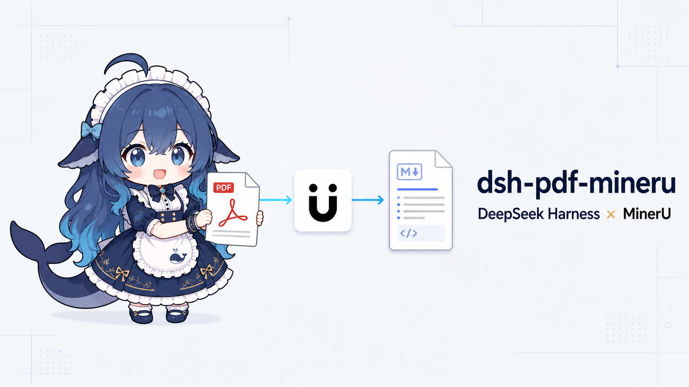
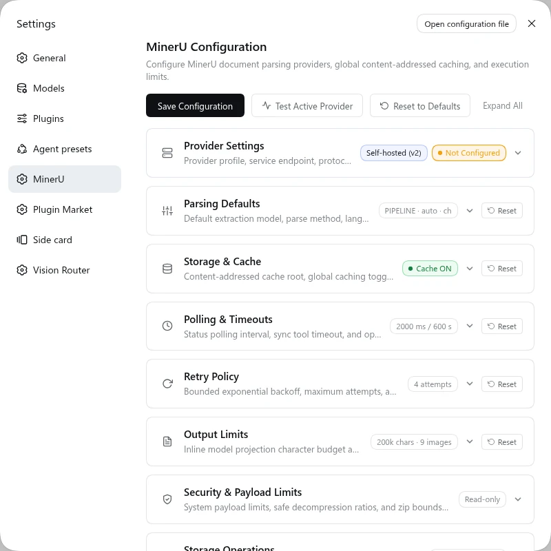
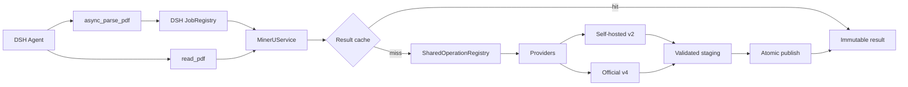

<div align="center">



# dsh-pdf-mineru

**让 DeepSeek Harness 拥有强大的 PDF 与文档智能解析能力**

支持 **MinerU 官方云 (v4)** 与 **私有化自建服务 (v2)**，为 AI Agent 提供高精度的文档版面分析、公式与表格提取、图文解析，原生支持后台异步任务与智能缓存。

<p>
  <a href="https://awesome-dsh-plugin.com"></a>
  <a href="https://www.npmjs.com/package/dsh-pdf-mineru"></a>
  <a href="./package.json"></a>
  =0.1.5-rc.2 (RC only)">
  
  <a href="./LICENSE"></a>
</p>

[✨ 核心亮点](#-核心亮点) · [🚀 快速开始](#-快速开始) · [💬 对话示例](#-对话与提示词示例) · [⚙️ 模型工具](#️-模型工具与参数参考) · [🏗️ 工作架构](#️-工作架构与流程) · [🔌 Provider 选型](#-provider-选型对比) · [🛠️ 设置与配置](#️-设置与配置参考) · [❓ 常见问题](#-常见问题-faq) · [🧑‍💻 开发者指南](#-开发者指南)

</div>

---

## ✨ 核心亮点

- 📑 **结构化提取与证据定位**：支持双栏正文、目录、LaTeX公式、表格、参考文献与插图；通过搜索、稳定块ID和原页核对检查解析证据，而非假设OCR无损。
- ☁️ **云端 / 本地自由切换**：支持开箱即用的 **MinerU 官方云 API**（无需本地显卡）与 **私有化自建服务**（数据不出内网），统一工具接口无缝切换。
- ⚡ **无感后台异步解析**：几十页至数百页的长篇论文或研报，Agent 会自动提交为 DSH 原生后台任务（Native Job），解析期间不阻塞聊天，解析完成后自动提醒。
- 💾 **智能内容寻址缓存**：基于文件指纹与解析配置自动去重，同一份文档无需重复解析，极大节省 Token、官方 API 额度与计算资源，二次调用秒级响应。
- 🖥️ **深度集成 Web GUI**：提供内置可视化设置面板，支持一键连通性测试、参数预设、缓存统计与磁盘管理，配置即改即用。

---

## 🚀 快速开始

### 0. 环境要求与版本兼容说明

> ⚠️ **重要版本声明与环境要求**：
> - **最低支持的 DSH 版本**：`>= 0.1.5-rc.2`。
> - **仅支持 RC 版本**：本插件**只会对 DeepSeek Harness 的 RC（Release Candidate）版本及后续正式发布版本进行官方支持**。由于早期 `alpha` 测试版本包含较多实验性且剧烈变动的内部 API，本插件不再对 `alpha` 等非稳定测试版本提供兼容与维护支持。
> - **运行环境要求**：Node.js `^22.19.0 || >=24.0.0`，包管理器推荐 `pnpm@11+`。

本次适配从插件 `0.0.12` 起以 DSH `v0.1.5-rc.2` 为基线。升级前请先升级宿主；现有 Provider 配置、缓存格式与工具参数无需因本次 DSH 适配而迁移。Web 设置与维护 RPC 仅在 `connection` 和 `webServer` 同时可用时注册；无 WebServer 的宿主仍可使用两个模型工具，但不提供这些 HTTP RPC。

### 1. 安装插件

在 DeepSeek Harness 环境中一键安装：

```sh
dsh plugin --profile web add dsh-pdf-mineru
```

> 本地开发或测试源码时，可使用：`dsh plugin --profile web add link:/absolute/path/to/dsh-pdf-mineru`

### 本地原页渲染的安装条件

正常安装插件会安装固定版本的 [pdfjs-dist 6.3.289](https://www.npmjs.com/package/pdfjs-dist/v/6.3.289)（Apache-2.0）和 [@napi-rs/canvas 1.0.9](https://www.npmjs.com/package/@napi-rs/canvas/v/1.0.9)（MIT）。在支持的平台且未禁用平台可选依赖时，**无需系统安装 Poppler 即可使用原有原页接口**；字体、CMap、WASM 都从安装包本地加载，无 CDN。

这并非“纯 JavaScript、无原生依赖”：Canvas 使用预编译 Skia/N-API 平台二进制，包管理器通过 optionalDependencies 选择平台包，无安装期编译脚本。上游提供 Linux x64/arm64（glibc、musl）、Linux armv7（glibc）、Linux riscv64（glibc）、macOS x64/arm64、Windows x64/arm64 和 Android arm64 包；仍要求匹配的系统 ABI/运行库和本插件 Node 版本；Canvas上游文档要求glibc ≥2.18、Linux arm64为Cortex-A57或更新、armv7为Cortex-A7或更新，Node自身的系统要求仍须同时满足。实际验收平台为 Linux x64 glibc（Node 22.19.0 与26.8.2的独立生产安装包），其它平台有上游二进制不等于本仓库逐一验收。不要使用会删掉平台包的 --no-optional 安装选项。两后端均不可用时会提示安装 Poppler，或在支持平台重新安装插件及其平台可选依赖；不会使普通文本阅读失效。

PDF.js 包解压约34.8 MB，Canvas JS 约0.13 MB，Linux x64 glibc 二进制约34.8 MB（十进制，其他平台不同），这是安装依赖体积，不是插件 tarball 体积。PDF.js 的 Node 要求覆盖本插件现有 Node.js `^22.19.0 || >=24.0.0` 范围。

只对依赖/执行环境不可用自动切换：损坏、加密、解析失败、页码越界、源摘要不匹配、取消、资源超限或超时不会通过换后端重试。后端间可能存在字体、抗锯齿、透明度和裁切保真差异，不承诺像素相同；详见[阅读指南](docs/model-reading.md)。

### 2. 配置与连接

打开 DSH 界面中的 **Settings → Plugins → MinerU**，根据您的使用场景选择 Provider：

<p align="center">
  
</p>

#### 方案 A：使用 MinerU 官方云（推荐，免部署）
1. 前往 [MinerU 官网](https://mineru.net) 注册并获取 API Token。
2. 在终端配置环境变量（或通过 DSH 凭据服务管理）：
   ```sh
   export MINERU_API_KEY="your-token-here"
   ```
3. 在设置中选择 **Official v4**，保持 **API Key Env Var** 为 `MINERU_API_KEY`，点击 **Test Active Provider** 即可完成验证。

#### 方案 B：使用本地 / 私有化自建服务
1. 启动您的 MinerU 自建服务（如 FastAPI v2，默认端口 18000）。
2. 在设置中选择 **Self-hosted v2**，填入服务地址（例如 `http://localhost:18000`）。
3. 若使用本地 HTTP，勾选 **Allow Insecure HTTP**，点击 **Test Active Provider** 验证连通。

### 3. 开始使用

配置完成后，无需记忆复杂指令，直接在聊天框中用自然语言对 Agent 下达需求即可！

---

## 💬 对话与提示词示例

Agent 会自动根据文档长度和指令意图，智能选择同步返回或后台异步处理：

### 场景 1：常规论文 / 报告解析
> **你**：“帮我解析 `/workspace/paper.pdf`，提取正文、数学公式和表格，整理成 Markdown 格式。”
> **Agent**：调用 `read_pdf`，直接返回排版好的 Markdown 文本与关键内联图表。

### 场景 2：超长文档后台全量解析（推荐）
> **你**：“请在后台解析这本 120 页的技术研报 `/data/annual-report.pdf`，解析完成后告诉我。”
> **Agent**：提交 `async_parse_pdf` 并返回任务 ID（如 `mineru-1`），全量解析到本地缓存，完成后返回文档结构化摘要（页数、大纲、表格数、图片数等），并提示使用 `read_pdf` 按需读取。

### 场景 3：按需切片读取（指定页码与关注内容）
> **你**：“读取 `/data/report.pdf` 的第 1 到 5 页中的表格。”
> **Agent**：调用 `read_pdf` 并传入 `pages: "1-5"` 与 `focus: "table"` 进行精准定向提取。

## ⚙️ 模型工具与参数参考

插件为 Agent 注册了两项核心文档解析工具：

| 工具名称 | 适用场景 | 说明 |
| --- | --- | --- |
| `read_pdf` | 同步读取 / 按需切片 | 同步读取 PDF，支持指定页码（`pages`）与内容类型（`focus`）切片提取，返回 Markdown 文本与按自然顺序排列的内联多模态图表 |
| `async_parse_pdf` | 长篇文档 / 后台解析 | 注册为 DSH 原生后台任务（`mineru-N`），全量解析 PDF 至本地缓存，完成后交付文档结构化摘要与后续阅读指引，不阻塞当前对话 |

### 证据阅读：定位 → 精读 → 续读 → 原页核对

1. 用 `focus: "toc"` 看目录，或用 `query: "图 7"` 字面检索。空格有意义，“图7”与“图 7”不同。
2. 用返回的 `block_id` 精读完整块，或用物理页码与focus选择内容。标题块不代表整节。
3. `content_status: "partial"` 时，以同一file_path和原样cursor继续，不重复pages/focus/block_id/query；结束时cursor为null。
4. 对关键公式、数值和图表，用 `view: "page"` 回看原页；可传source_sha256作为expected_sha256。

**complete只表示所选解析文本交付完成，不保证OCR正确或图像全部展示。** 检查当前块的diagnostics、公式verification_hints及visuals；metadata_shortened表示元数据因预算未完整列出。

- 默认响应预算12,000个UTF-16单元、正文每块最多8,000；JSON和Native文本各最多48,000字节。默认不重复返回缓存路径；导出用focus: artifacts。
- `inline_images` 首次省略默认true，续读省略继承，显式布尔值覆盖；模型能力和图像预算始终构成上限。
- **0.0.14起使用v3游标，0.0.15保持该协议及索引v2；旧v1/v2游标需重新开始，解析缓存无需迁移。** 续读不会在缓存丢失时偷偷重新上传。
- 原页模式优先使用 PATH 中的 Poppler（pdfinfo/pdftoppm），命令缺失或明确不可执行时自动回退到 PDF.js + Node Canvas 子进程；仍需图像模型、附件服务及大于0的图像预算。结果以 `renderer: "poppler" | "pdfjs"` 标明后端，不会上传PDF或要求模型重新调用。它是本地有界执行，不是OS级隔离沙箱。

字段语义、完整示例、来源/索引版本、预算、安全边界、错误恢复和离线验收见 **[PDF阅读指南](docs/model-reading.md)**。更新插件后需要让宿主重新加载工具定义；只构建源码或刷新Web页面不等于后端已重载。

### 常用解析参数（均可通过自然语言告知 Agent）

| 参数 | 类型 | 适用工具 | 作用说明 |
| --- | --- | --- | --- |
| `file_path` | `string` | 全部 | 待解析/读取的本地文件路径（必填） |
| `pages` | `number` / `string` / `number[]` | `read_pdf` | 1-based 页码选择，支持单页（如 `3`）、数组（如 `[1, 2, 5]`）或范围字符串（如 `"1-3, 5"`） |
| `focus` | `string` / `string[]` | `read_pdf` | `all`（默认）、`text`、`table`、`image`、`toc` 或 `artifacts` |
| `cursor` | `string` | `read_pdf` | 原样传回上一条部分阅读响应的 token；与 `pages`／`focus`／`block_id`／`query` 互斥，仍须传同一 `file_path` |
| `block_id` | `string` | `read_pdf` | 原样使用此前返回的稳定块 ID；与 `query`、`cursor` 互斥 |
| `query` | `string` | `read_pdf` | 1–256 字符、不区分大小写的字面检索；返回上下文摘要与块 ID，再用 `block_id` 读全文 |
| `view` | `"content"` / `"page"` | `read_pdf` | 默认解析文本；page 模式只接受一页 `pages`，本地渲染原页，不调用 Provider |
| `expected_sha256` | `string` | `read_pdf` | 仅 page 模式；可选的源文件 SHA-256，通常来自此前结果的 `source_sha256` |
| `inline_images` | `boolean` | `read_pdf` | 首次省略默认true；续读省略继承，显式值覆盖，仍受模型能力和图像预算约束 |
| `poll_timeout_ms` | `number` | `read_pdf` | 最大同步等待超时毫秒数 |

---

## 🏗️ 工作架构与流程



- **统一工具分发**：Agent 发起的同步请求（`read_pdf`）直接返回结果，异步长任务（`async_parse_pdf`）交由 DSH 原生 JobRegistry 调度。
- **缓存复用**：按文件 SHA-256 与解析语义寻址；命中时无需重新提交上游解析，但仍校验本地源文件及产物。
- **并发请求合并**：同进程内的并发重复请求由 `SharedOperationRegistry` 合并，避免重复向上游提交。
- **双 Provider 适配**：上游适配自建 FastAPI v2 或官方云 v4，解析产物经校验后原子发布。

## 🔌 Provider 选型对比

| 维度 | 官方云服务 (Official v4) | 本地 / 私有化自建 (Self-hosted v2) |
| --- | --- | --- |
| **部署难度** | ⭐ **零门槛**（仅需配置 API Key） | 需自行部署 MinerU FastAPI 服务及模型环境 |
| **硬件要求** | 无需本地 GPU，云端集群算力支持 | 推荐配备 NVIDIA GPU 显卡 |
| **数据安全性** | 数据上传至 MinerU 官方云端解析 | 由自建服务的部署位置、网络与安全配置决定 |
| **支持模型** | 原生支持 `pipeline` 与 `vlm` | 支持 `pipeline`，亦可通过 `modelMap` 映射自建 VLM 引擎 |
| **单文件限制** | 单文件最大 200 MB，最多 200 页 | 取决于自建服务端硬件与配置 |
| **网络协议** | 强制 HTTPS，安全传输 | 支持 HTTP / HTTPS，本地可配置 `allowInsecureHttp` |

---

## 🛠️ 设置与配置参考

推荐直接在 **DSH Web GUI (Settings → Plugins → MinerU)** 中进行可视化调整。若需要直接编辑配置文件（`cordis.patch.yml`），可参考以下常用配置：

<details>
<summary><strong>📋 点击展开：YAML 配置示例</strong></summary>

### 1. 官方云 (Official v4) 推荐配置
```yaml
schemaVersion: 2
activeProvider: mp_official
providers:
  - id: mp_official
    type: official-v4
    baseURL: https://mineru.net/api/v4
    apiKeyEnv: MINERU_API_KEY
    models: [pipeline, vlm]
defaults:
  model: vlm
  ocr: false
  formula: true
  table: true
```

### 2. 本地私有化 (Self-hosted v2) 推荐配置
```yaml
schemaVersion: 2
activeProvider: mp_self_hosted
providers:
  - id: mp_self_hosted
    type: self-hosted-v2
    baseURL: http://localhost:18000
    allowInsecureHttp: true
    modelMap:
      pipeline: pipeline
      vlm: vlm-engine
defaults:
  model: pipeline
  ocr: false
  formula: true
  table: true
```

### 3. 存储与限制自定义（可选）
```yaml
storage:
  storageRoot: /absolute/path/to/dsh/cache/pdf-mineru  # 默认在 $DSH_HOME/cache/pdf-mineru
  cacheEnabled: true
output:
  maxInlineChars: 12000   # 单次响应预算；正文每块另限 8000 UTF-16 单元
  maxInlineImages: 6      # 单次 read_pdf 响应最多内联图片数（0–100）
limits:
  maxFileBytes: 209715200  # 200 MB
```

</details>

### 多进程共享存储与升级

多个进程可以共享同一 `storageRoot`，前提是同一主机、同一 PID 可见命名空间及支持 hard link 的一致本地文件系统。不支持 NFS、跨主机或互不可见 PID 的容器共享这一锁协议。

升级时请先停止所有使用该目录的 MinerU 进程，再统一更新并重启。新协议的 `.process.lock` 是持久版本隔离标记，实际互斥与使用记录位于 `.lock/`；它不是应当在退出时删除的“残留锁”。遇到旧锁或损坏记录，请先确认所有相关进程已停止，再按错误提示人工恢复，切勿在活跃进程运行时删除协调文件。

`storageRoot` 与 `limits.*` 在启动时固定。运行中的配置保存会拒绝这些值的变更；应修改宿主配置并重启插件，不能依赖一次被拒绝的保存自动生效。

---

## ❓ 常见问题 (FAQ)

<details>
<summary><strong>Q: 如何获取 MinerU 官方 API Token？</strong></summary>

1. 访问 [MinerU 官网 (mineru.net)](https://mineru.net) 注册账号。
2. 在个人中心创建并复制您的 API Key。
3. 导出为环境变量 `export MINERU_API_KEY="xxx"`，或在 DSH Settings 中统一管理。
</details>

<details>
<summary><strong>Q: 扫描版 PDF 或图片文档识别不准怎么办？</strong></summary>

普通纯文本 PDF 通常可以使用默认设置。对于扫描件或识别效果不佳的文档，在 MinerU 设置中将 **Default Parse Method** 改为 `ocr`；`ocr` 布尔值由该选择保持一致。模型工具不接受 `ocr`、`model` 等技术参数，不能通过向 `read_pdf` 添加这些参数切换解析方式。
</details>

<details>
<summary><strong>Q: Pipeline 和 VLM 模型有什么区别？</strong></summary>

- **Pipeline 模式**：采用经典版面分析 + 规则提取管线，解析速度快，资源消耗低，适合大多数标准版面论文、电子书和报表。
- **VLM 模式**：引入端到端视觉多模态大模型，对极其复杂的图文混排、手写公式、艺术字体及特殊图表有更出色的理解力。
</details>

<details>
<summary><strong>Q: 解析结果保存在哪里？如何清理缓存？</strong></summary>

解析结果按源文件内容、解析语义及 Provider 兼容标识寻址，默认存放在 `$DSH_HOME/cache/pdf-mineru/results/`。启用缓存复用时，后续阅读可复用已发布结果；同进程并发请求合并，但不同进程仍可能分别提交上游解析，不保证跨进程只计费一次。`storage.cacheEnabled=false` 仅禁用解析前的缓存复用，结果仍会不可变发布，不等同于清空缓存或强制覆盖已有结果。
您可以在 **Settings → Plugins → MinerU** 的运维区域中：
- 点击 **Verify Cache** 检查缓存完整性；
- 点击 **Clear Cache** 预览，再显式确认清除。破坏性维护在存在活跃读取或解析时拒绝执行，不会为了清理而取消它们。
</details>

<details>
<summary><strong>Q: 后台异步任务中途可以取消吗？</strong></summary>

可以。DSH 会话中可通过通用的任务管理（如 `job_kill`）随时取消对任务的等待。
</details>

---

## 🧑‍💻 开发者指南

如果您希望对插件进行二次开发或贡献代码：

```sh
# 1. 安装依赖
pnpm install

# 2. 类型检查与测试
pnpm run typecheck
pnpm test

# 3. 构建产物
pnpm run build

# 4. 在运行中的 DSH Web 中验证前端设置组件
pnpm run verify:gui

# 5. （可选）本地原页验证，无上传；第二条用空PATH验证PDF.js自动回退
pnpm run smoke:reader-local -- /path/to/sample.pdf 1 --backend=auto
pnpm run smoke:reader-local -- /path/to/sample.pdf 1 .vitest-cache/pdfjs --backend=pdfjs

# 6. （显式选择）使用真实 Token 运行在线解析，会上传文档
MINERU_API_KEY=<token> pnpm run smoke:official-v4 -- /path/to/sample.pdf
```

> 文档入口：[PDF阅读指南](docs/model-reading.md) · [版本记录](CHANGELOG.md)。已完成的阶段性开发报告不作为当前使用契约维护，历史信息可从Git记录查阅。

> 想要深入了解插件的架构设计、数据模型、并发请求合并、安全解包与存储隔离机制？请查阅 **[ARCHITECTURE.md](./ARCHITECTURE.md)**。

---

## 📜 许可证与致谢

- 本项目基于 [MIT License](./LICENSE) 开源。
- 感谢 [DeepSeek Harness](https://github.com/deepseek-ai/deepseek-harness) 提供的卓越插件体系。
- 感谢 [OpenDataLab MinerU](https://github.com/opendatalab/MinerU) 提供的文档解析能力。
- 感谢 [Huanlin/dsh-plugin-mineru](https://github.com/HuanLinOTO/dsh-plugin-mineru) 带来的早期设计灵感。
- 本插件已被 [Awesome DeepSeek Harness Plugin](https://github.com/awesome-dsh-plugin/awesome-dsh-plugin) 社区精选列表收录（[收录详情页](https://awesome-dsh-plugin.com/p/Yurzi/dsh-pdf-mineru)）。
- Banner 图像中的 DeepSeek 鲸鱼娘形象由上善无形原创角色与 ZipZipPipe 二创设计衍生，遵循 [CC BY-NC-SA 4.0](https://creativecommons.org/licenses/by-nc-sa/4.0/deed.zh-hans) 许可。
